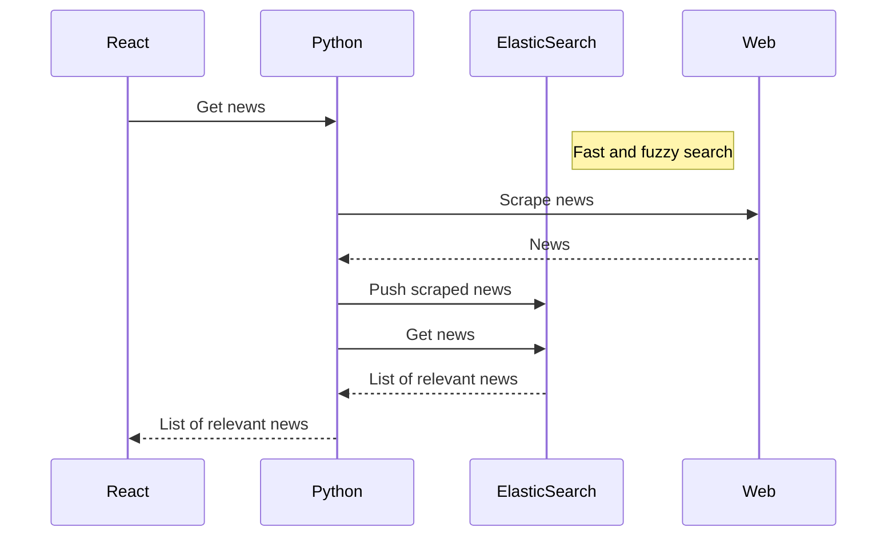

# News Recommendation

A simple web application that allows users to search for news from 
[Aftonbladet](https://aftonbladet.se) and [New York Times](https://nytimes.com).
This application is developed from this 
[blog tuturial](https://medium.com/@dvirarad/creating-a-movie-search-application-with-python-react-and-elasticsearch-14e0450b8bd) on how to make a movie search application,
but most of the code is rewritten and the application is heavily 
changed to support news search instead of movie search.

## Installation

To install and run the news recommendation application, you will need to have 
the following dependencies installed on your computer:

-   Node.js and npm (the Node.js package manager)
-   Python 3.9
-   Docker (for running elasticsearch)

### Node.js and npm
Make sure you have Node.js and npm installed. You can check if you have 
them installed by running the following commands in your terminal:
```
node -v
npm -v
```
If you don't have Node.js and npm installed, you can download and install them 
from the official website ([https://nodejs.org/](https://nodejs.org/)) or 
using a package manager like Homebrew (for macOS) or Chocolatey (for Windows).

### Python 3.9

Make sure you have Python 3.x installed. You can check if you have it 
installed by running the following command in your terminal:

```python --version```

### Elasticsearch

Elastic is run in a docker container in this project, so you need to install docker first.
The elastic container needs some options set to run, so the following 
convenience script is used to start the container:

```bash
./run_docker.sh
```

Verify that the Elasticsearch container is running by making a GET request 
to the  `http://localhost:9200` endpoint:

    curl http://localhost:9200

### Install the dependencies

Install the Node.js dependencies:

`npm install` 

Install the Python dependencies:

`pip install -r requirements.txt` 

This will install all the required packages and libraries that the news 
recommendation application depends on.

### Scrape news from the web

The scraping application has been developed using the python Scrapy framework. 
There are currently two spiders, one for Aftonbladet and one for New York Times.
To run the spiders, run the following commands in your terminal:

```bash
cd news_scraper
scrapy crawl aftonbladet
scrapy crawl nytimes
```

The application will automatically push the scraped articles to the elasticsearch server.

### Start the application

To start the application in development mode, when the elasticsearch docker is 
already running, run the following commands in your terminal:

`npm start` 

and 

`python3 backend.py`

This will start the React development server and the Python server. The application 
will be available at [http://localhost:3000](http://localhost:3000/) in your web browser.

## UML diagrams

